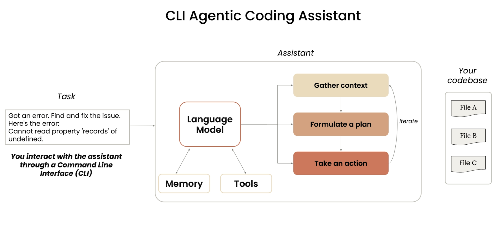
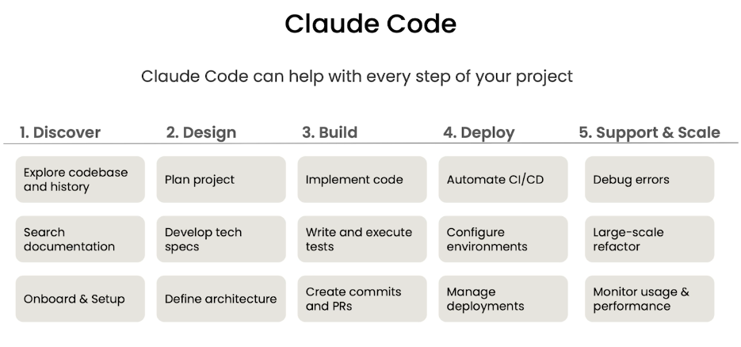
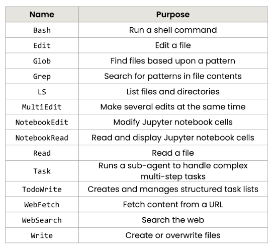
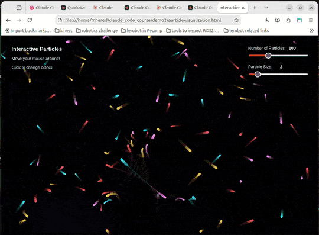

# Claude Code: A Highly Agentic Coding Assistant

https://learn.deeplearning.ai/courses/claude-code-a-highly-agentic-coding-assistant/

## Lesson 1 - Intro (4')

Short course (2h) on best practices for using Claude Code by Anthropic including interaction with git worktrees and MCP servers. Coordinating several instances of the agent in a codebase

Key tip: provide Claude Code a clear context: 

1) point to relevant files 
2) describe desired features and functionalities clearly
3) extend Claude Code with MCP servers and other tools in the ecosystem  

Three examples:

1. develop a RAG chatbot: refactoring, writing tests, using github integration to work with pull requests and fixing issues. Planning, thinking mode, creating parallel sessions and managing Claude's memory
2. transform a Jupyter notebook that analizes e-commerce data into a dashboard: refactor, remove redundant code, create a dashboard
3. build a webapp from a FIGMA visual mockup using MCP servers to iterate, test and build agentically a front end app 

Claude code reads codebase and takes notes in `claude.md`

## Lesson 2 - What is Claude Code? (8')

agentic workflow

tools it uses to navigate the codebase

memory across sessions



agentic coding assistant = model + set of tools + environment to run these tools

* language models handle input and return output: Opus, Sonnet etc

* CLI to interact with the assistant 

* memory to remember user preferences the codebase and the task at hand: `claude.md`file contains configuration, style preferences, and the conversation history is stored locally

* environment: where it can determine the data needed, formulate a plan and take action

Claude Code can help with: 

* exploring and explaining a codebase and/or documentation
* designing: planning, developing specs, defining architecture
* writing code and tests, using it in github (commits and PRs), refactoring, debugging, performing data analysis



the model comes with a number of tools that allow gathering the context and navigating the codebase without indexing it (security risk):

* editing:`Edit`, `MultiEdit`, `NotebookEdit`, `Write` 
* reading: `Read`, `NotebookRead`
* searching and finding patterns: `Glob`, `Grep`, `LS`
* searching the web: `WebFetch`, `WebSearch`
* managing subagents: `Task`,`TodoWrite`
*  executing shell commands: `Bash`



This list of tools is extensible using MCP servers

### Demo

Install Claude Code (ref: https://code.claude.com/docs/en/overview) :

```bash
curl -fsSL https://claude.ai/install.sh | bash
```

Create a Pro Claude.ai account and paste the code in Claude Code to login.

Made two demos:

`./demo/visualization.py`


`./demo2/particle-visualization.html`




## Lesson 3 - Course notes (1')

### Links to Course Codebase Examples

Here are the links to the coding examples covered in the lessons:

1. Codebase for the RAG chatbot (Lessons 2-6)

   - Here's [the repo](https://github.com/https-deeplearning-ai/starting-ragchatbot-codebase.git) of the starting codebase used in lesson 2.
   - Lessons 3-6 add features to the starting codebase.
   - Here's [the state](https://github.com/https-deeplearning-ai/ragchatbot-codebase.git) of the codebase after lesson 5.

   Feel free to fork the starting codebase and follow the lessons' activities.

2. E-commerce data analysis (Lesson 7)

   - Here are [the lesson's files](https://github.com/https-deeplearning-ai/sc-claude-code-files/tree/main/lesson7_files).
   - It includes the data, the starting and refactored notebooks, and the dashboard file.

   Feel free to fork this repo, and try lesson 7 tasks using the starting notebook and the data folder.

3. Figma design mockup (Lesson 8)

   - Here's [the link](https://github.com/https-deeplearning-ai/sc-claude-code-files/blob/main/additional_files/key-indicators.fig) to the Figma mockup design (which you can open with [Figma Desktop App](https://help.figma.com/hc/en-us/articles/5601429983767-Guide-to-the-Figma-desktop-app)).
   - In lesson 8, you will build a Next.js app based on this mockup.
   - Here's the [link](https://github.com/https-deeplearning-ai/FRED-dashboard.git) to the repo of the app we got during filming.

### Prompts and Summaries of Lessons

You can find the prompts used in each lesson and a summary of Claude  Code features in the optional reading item at the end of the course  (Prompts & Summaries of Lessons). You can also find them in this [repo](https://github.com/https-deeplearning-ai/sc-claude-code-files/tree/main/reading_notes).

## Lesson 4 - Understanding the RAG Chatbot codebase (14')